## Отчет по лабораторной работе №2 "Эмуляция распределенной корпоративной сети связи, настройка статической маршрутизации между филиалами"

University: [ITMO University](https://itmo.ru/ru/)

Faculty: [FICT](https://fict.itmo.ru)

Course: [Introduction in routing](https://github.com/itmo-ict-faculty/introduction-in-routing)

Year: 2023-2024
Group: K33202

Author: Islamov Sergey Sergeevich

Lab: Lab2

Date of create: 10.12.2023

Date of finished: 10.12.2023

### Цель работы
Ознакомиться с принципами планирования IP адресов, настройке статической маршрутизации и сетевыми функциями устройств.

### Ход работы
#### 1. В файле топологии сети ```lab2.clab.yaml``` пропишем ноды у устройств.
Содержимое файла: 
```
name: lab2

mgmt:
  network: SerejjaNet
  ipv4_subnet: 192.10.10.0/24

topology:
  nodes:
    R01.MSK:
      kind: vr-ros
      image: vrnetlab/vr-routeros:6.47.9
      mgmt_ipv4: 192.10.10.2
    
    R01.FRT:
      kind: vr-ros
      image: vrnetlab/vr-routeros:6.47.9
      mgmt_ipv4: 192.10.10.3

    R01.BRL:
      kind: vr-ros
      image: vrnetlab/vr-routeros:6.47.9
      mgmt_ipv4: 192.10.10.4


    PC1: 
      kind: vr-ros
      image: vrnetlab/vr-routeros:6.47.9
      mgmt_ipv4: 192.10.10.11

    PC2: 
      kind: vr-ros
      image: vrnetlab/vr-routeros:6.47.9
      mgmt_ipv4: 192.10.10.12

    PC3: 
      kind: vr-ros
      image: vrnetlab/vr-routeros:6.47.9
      mgmt_ipv4: 192.10.10.13

  links:
    - endpoints: ["R01.MSK:eth2", "R01.BRL:eth2"]
    - endpoints: ["R01.BRL:eth3", "R01.FRT:eth2"]
    - endpoints: ["R01.MSK:eth3", "R01.FRT:eth3"]
    - endpoints: ["R01.MSK:eth4", "PC1:eth2"]
    - endpoints: ["R01.FRT:eth4", "PC2:eth2"]
    - endpoints: ["R01.BRL:eth4", "PC3:eth2"]
```

#### 2. Развернем докер контейнер: 
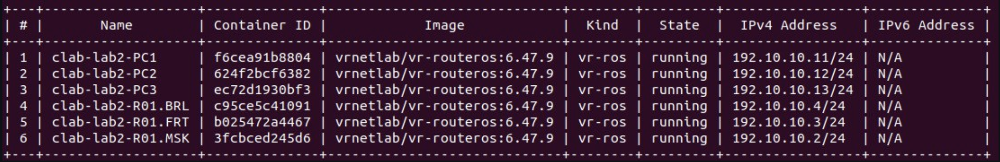

#### 3. Прописываем параметры каждому устройству в сети
Текст конфигураций сетевых устройств: 
- Роутер R01.MSK: \
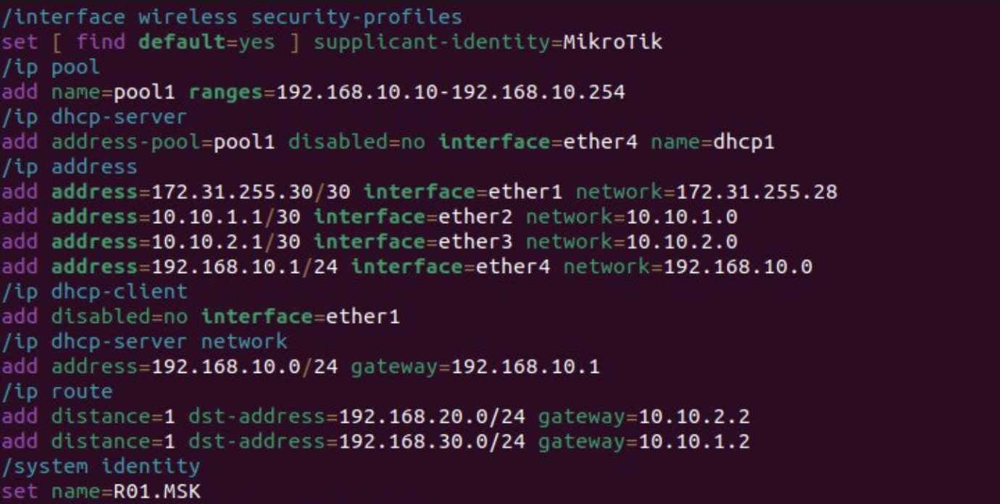
- Роутер R01.FRT: \
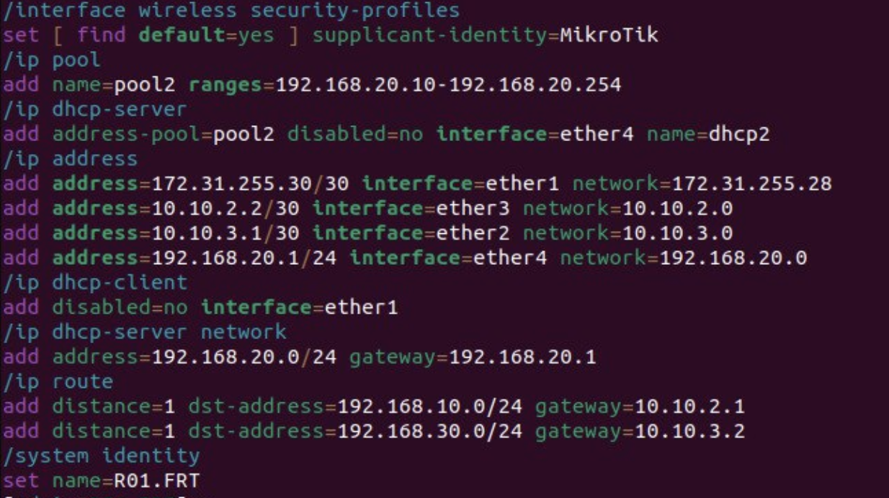
- Роутер R01.BRL: \
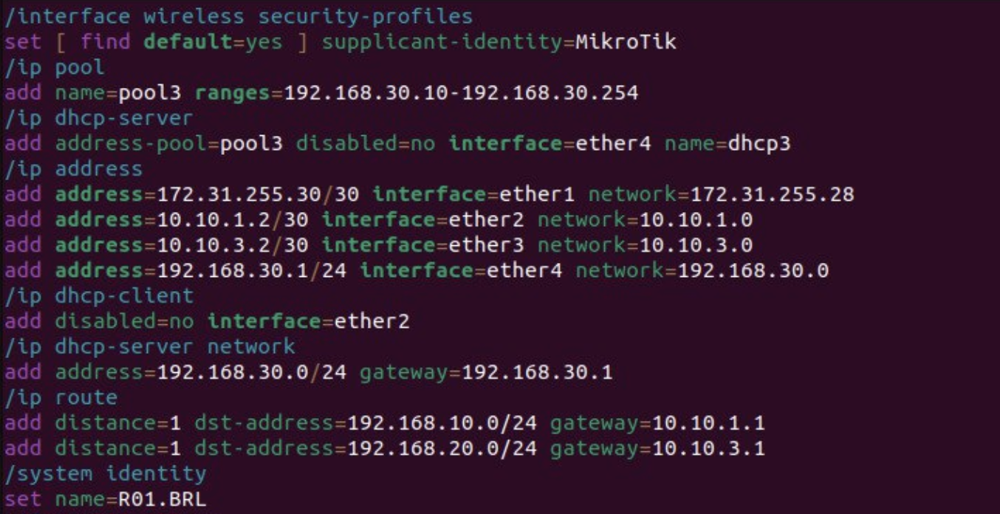
- PC1: \
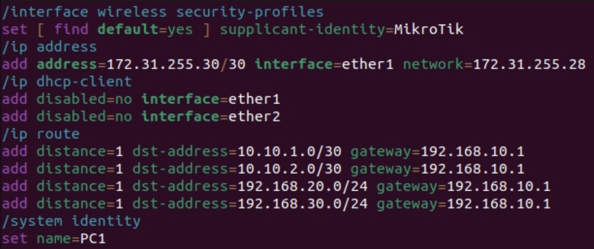
- PC2: \
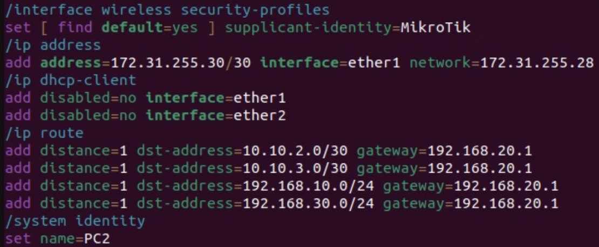
- PC3: \
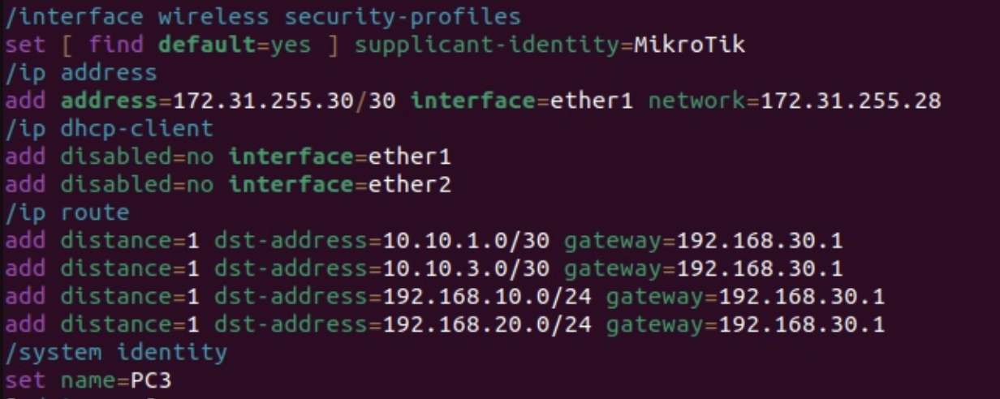

#### 4. Схема сети в draw.io(референс взят из лабораторной работы 2)

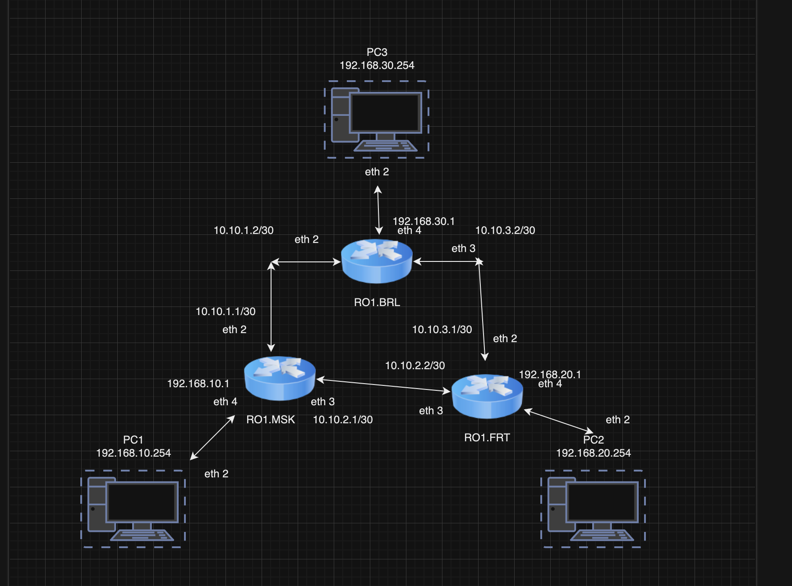

#### 5. Пропингуем устройства внутри сети, для проверки локальной связности
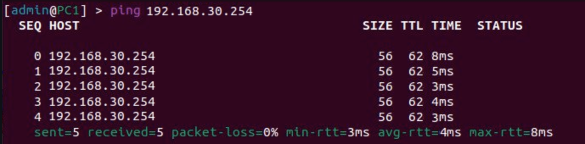
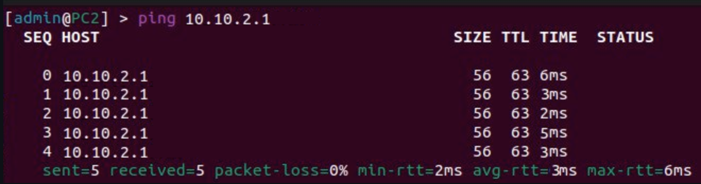
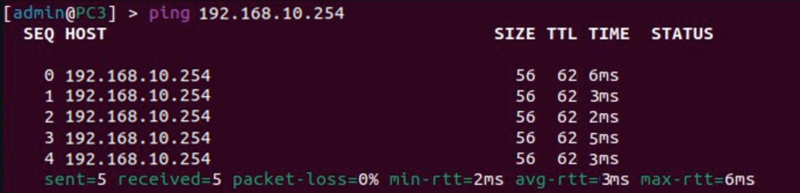

#### 6. Вывод

Выполняя данную лабораторную работу произошло ознокомление с принципами планирования IP-адресов, были выполнены настройки статической маршрутизации и сетевых функций устройства, а также построена сеть связи в трех офисах.
