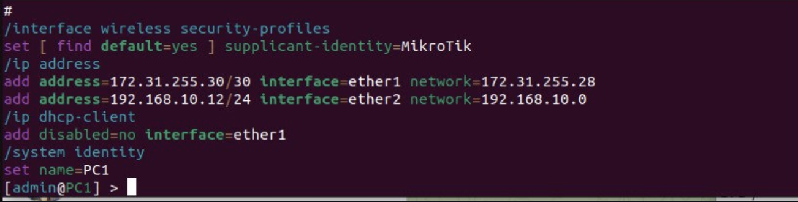

## Лабораторная работа №3 "Эмуляция распределенной корпоративной сети связи, настройка OSPF и MPLS, организация первого EoMPLS"

University: [ITMO University](https://itmo.ru/ru/)

Faculty: [FICT](https://fict.itmo.ru)

Course: [Introduction in routing](https://github.com/itmo-ict-faculty/introduction-in-routing)

Year: 2022/2023

Group: K33202

Author: Islamov Sergey Sergeevich

Lab: Lab3

Date of create: 16.12.2022

Date of finished: 17.12.2022

### Цель работы
Изучить протоколы OSPF и MPLS, механизмы организации EoMPLS.

### Ход работы
#### 1. В файте топологии сети ```lab3.clab.yaml``` пропишем ноды у устройств.
Содержимое файла:
```
name: lab3

mgmt:
    network: Net3
    ipv4_subnet: 192.30.31.0/24

topology:
    nodes:
        R01.NY:
            kind: vr-ros
            image: vrnetlab/vr-routeros:6.47.9
            mgmt_ipv4: 192.30.31.11
        R01.LND:
            kind: vr-ros
            image: vrnetlab/vr-routeros:6.47.9
            mgmt_ipv4: 192.30.31.12
        R01.LBN:
            kind: vr-ros
            image: vrnetlab/vr-routeros:6.47.9
            mgmt_ipv4: 192.30.31.13
        R01.HKI:
            kind: vr-ros
            image: vrnetlab/vr-routeros:6.47.9
            mgmt_ipv4: 192.30.31.14
        R01.MSK:
            kind: vr-ros
            image: vrnetlab/vr-routeros:6.47.9
            mgmt_ipv4: 192.30.31.15
        R01.SPB:
            kind: vr-ros
            image: vrnetlab/vr-routeros:6.47.9
            mgmt_ipv4: 192.30.31.16
        SGI_Prism:
            kind: vr-ros
            image: vrnetlab/vr-routeros:6.47.9
            mgmt_ipv4: 192.30.31.17
        PC1:
            kind: vr-ros
            image: vrnetlab/vr-routeros:6.47.9
            mgmt_ipv4: 192.30.31.18
    links:
        - endpoints: ["R01.NY:eth2", "SGI_Prism:eth2"]
        - endpoints: ["R01.NY:eth3", "R01.LND:eth2"]
        - endpoints: ["R01.NY:eth4", "R01.LBN:eth2"]
        - endpoints: ["R01.LND:eth3", "R01.HKI:eth2"]
        - endpoints: ["R01.LBN:eth3", "R01.MSK:eth2"]
        - endpoints: ["R01.LBN:eth4", "R01.HKI:eth4"]
        - endpoints: ["R01.HKI:eth3", "R01.SPB:eth3"]
        - endpoints: ["R01.MSK:eth3", "R01.SPB:eth2"]
        - endpoints: ["R01.SPB:eth4", "PC1:eth2"]
```

#### 2. Разворачиваем контейнер 


#### 3. Прописываем параметры каждому устройству
Текст конфигураций сетевых устройств:
- Роутер R01.NY


- Роутер R01.LND


- Роутер R01.LBN


- Роутер R01.HKI


- Роутер R01.MSK


- Роутер R01.SPB


- SGI-Prism


- PC1



#### 4. Таблицы маршрутизации для каждого роутера:


#### 5. Информация об MPLS метках:


#### 6. Схема сети

#### 7. Проверка пинга ПК и сервера


#### 8. Вывод
В результате выполения данной лабораторной работы были изучены протоколы OSPF и MPLS, а также механизмы организации EoMPLS.
